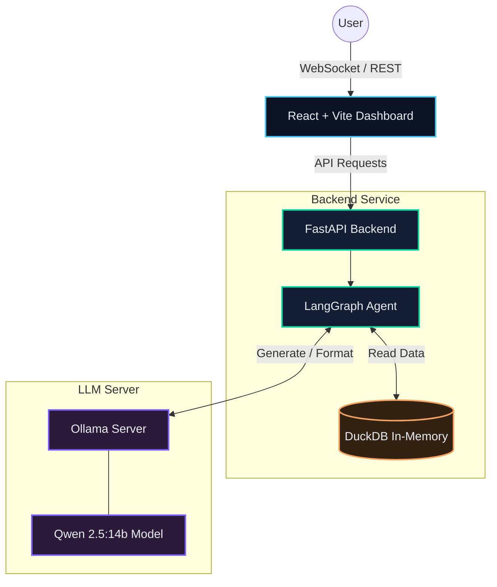

# Marassi Smart City — Public Safety Agent

AI-powered natural-language interface over AVEVA Historian data for smart city public safety monitoring.

## Architecture

The system uses a decoupled, three-tier architecture with an intelligent LangGraph pipeline that isolates LLM calls to prevent hallucinations against the database schema.



### Agent Pipeline (5 Nodes, Only 2 LLM Calls)

To ensure determinism and prevent SQL hallucinations, the agent only uses the LLM for understanding and formatting:

```mermaid
sequenceDiagram
    participant User
    participant LLM as Qwen 2.5 (LLM)
    participant Agent as Agent (Python)
    participant DB as DuckDB
    
    User->>Agent: "What's the VIP traffic?"
    
    rect rgb(30, 20, 50)
        Agent->>LLM: 1. Extract Intent & Time
        LLM-->>Agent: {"intent": "current_value", "location": "VIP"}
    end
    
    rect rgb(20, 40, 50)
        Note over Agent: 2. Tag Resolver (Fuzzy Match)<br/>3. Query Builder (SQL string)
        Agent->>DB: 4. Executor (DuckDB)
        DB-->>Agent: Result Data
    end
    
    rect rgb(30, 20, 50)
        Agent->>LLM: 5. Answer Formatter
        LLM-->>Agent: "The current VIP traffic is 45."
    end
    
    Agent->>User: Natural Language Response
```



## Quick Start

You can run the application either natively (recommended) or via Docker.

### Option A: Run Natively (Recommended)
*Requires [Node.js](https://nodejs.org/en) and Python 3.12+ installed.*

```bash
# Start both backend and frontend automatically
python all.py
```
*The script will open the backend on port 8000 and the frontend dashboard on port 5173.*

### Option B: Run via Docker
*Requires Docker Desktop.*

```bash
# Build and start the containers
docker compose up -d --build
```

## Data

8 CSV files from AVEVA Historian (~41,000 rows, Feb–May 2026):

| Domain | Tags | Description |
|--------|------|-------------|
| Access Control | AccessChannels_QR, Beaches_Vip, MainGate_Vip | Visitor counts at access points |
| CCTV | cameras_total_number, Total_disabled_cameras, Total_enabled_cameras | Camera fleet status |
| Gate APIs | Gates.Fail, Gates.Success | Gate API transaction counts |

## API Endpoints

| Method | Endpoint | Description |
|--------|----------|-------------|
| `POST` | `/api/ask` | Ask a natural language question |
| `WS` | `/api/ws/chat` | WebSocket streaming chat |
| `GET` | `/api/tags` | List all available tags |
| `GET` | `/api/metrics/latest` | Latest values for all tags |
| `GET` | `/api/metrics/{tag}/history` | Time-series data for a tag |
| `GET` | `/api/health` | System health check |

## Example Questions

- "What is the current count at the Beaches VIP access point?"
- "How many CCTV cameras are disabled right now?"
- "Show me the gate failure trend"
- "What was the peak traffic at Main Gate?"
- "Average gate failures over the last 24 hours?"

## Environment Variables

| Variable | Default | Purpose |
|----------|---------|---------|
| `OLLAMA_MODEL` | `qwen2.5:14b` | Ollama model name |
| `OLLAMA_BASE_URL` | `http://ollama:11434` | Ollama server URL |
| `DATA_DIR` | `/app/data` | Path to CSV files |

## Development

```bash
# Backend only (no Docker)
cd backend
pip install -r requirements.txt
DATA_DIR=../data OLLAMA_BASE_URL=http://localhost:11434 uvicorn main:app --reload

# Frontend only
cd frontend
npm install
npm run dev

# Test data layer (no LLM needed)
cd backend
python -m agent.graph --no-llm --data-dir ../data
```
